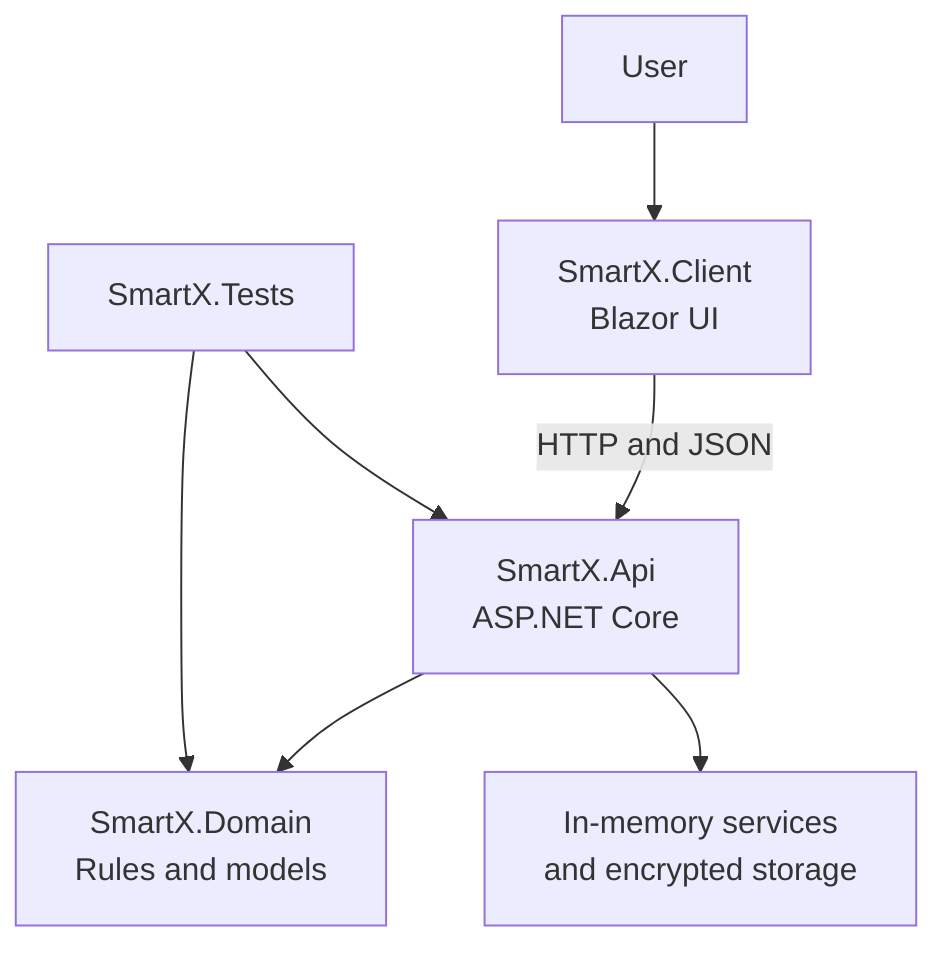
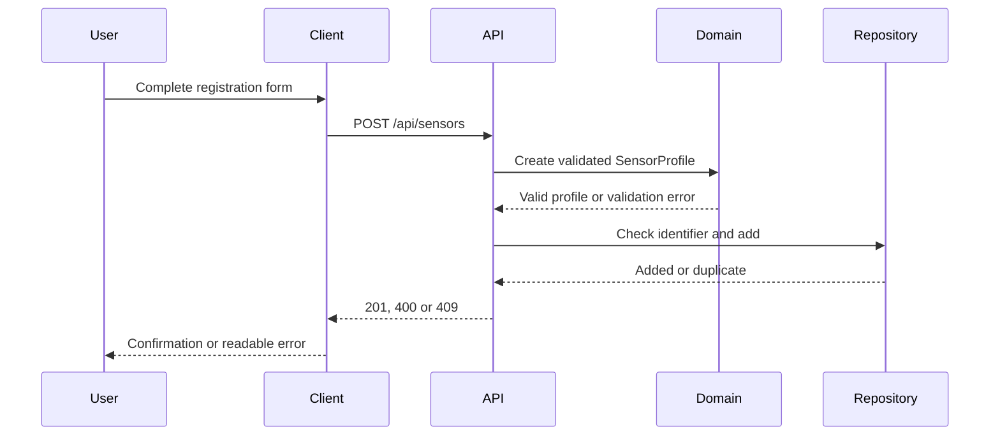

# Smart-X IoT Sensor Management and Telemetry Platform

## PROG7312 — Part 1, Task 2 - ST10442676

| Submission detail | Information |
|---|---|
| Student | Tiasha Pillay |
| Student number | ST10442676 |
| Project | Smart-X IoT Sensor Management and Telemetry Platform |
| Framework | ASP.NET Core and Blazor on .NET 9 |
| Solution | `Smart-X.sln` |
| Submission scope | Part 1 — Sensor Data Ingestion and Telemetry |
| Automated verification | 22 tests passed, 0 failed |

---

## Table of Contents

1. [Project Overview](#project-overview)
2. [Problem Statement](#problem-statement)
3. [Project Objectives](#project-objectives)
4. [Scope and Three-Pillar Roadmap](#scope-and-three-pillar-roadmap)
5. [Implemented Features](#implemented-features)
6. [System Architecture](#system-architecture)
7. [Solution Structure](#solution-structure)
8. [Technology Stack](#technology-stack)
9. [Domain Design](#domain-design)
10. [Sensor Registration](#sensor-registration)
11. [Generic Telemetry Processing](#generic-telemetry-processing)
12. [Telemetry Classification](#telemetry-classification)
13. [Encrypted Attachment Management](#encrypted-attachment-management)
14. [Gateway Pulse Dynamic Feature](#gateway-pulse-dynamic-feature)
15. [Advanced C# Requirements](#advanced-c-requirements)
16. [API Reference](#api-reference)
17. [Validation and Error Handling](#validation-and-error-handling)
18. [Security Design](#security-design)
19. [User Interface](#user-interface)
20. [Prerequisites](#prerequisites)
21. [Installation and Configuration](#installation-and-configuration)
22. [Running the Application](#running-the-application)
23. [Testing](#testing)
24. [Continuous Integration](#continuous-integration)
25. [Performance and Memory Considerations](#performance-and-memory-considerations)
26. [Rubric Evidence Matrix](#rubric-evidence-matrix)
27. [Known Limitations](#known-limitations)
28. [Future Development](#future-development)
29. [Troubleshooting](#troubleshooting)
30. [Final Submission Checklist](#final-submission-checklist)
31. [Author](#author)

---

## Project Overview

Smart-X started with a straightforward question: what information would an operator actually need before trusting data from an IoT sensor? A reading is not very useful on its own. The system also needs to know which device produced it, where that device is installed, what type of value it publishes, and what range should be treated as normal.

I built Smart-X around that context. In the Part 1 workflow, a user registers a sensor, records its deployment details, and chooses whether it publishes floating-point, integer, or Boolean values. The user can then submit readings, inspect their history, and immediately see whether numeric values fall inside or outside the expected operating range. Supporting files, such as configuration documents and hardware logs, can also be attached to a sensor and are encrypted before they are stored.

I separated the solution into Domain, API, Client, and Tests projects because I did not want business rules tied directly to a page or controller. This separation made faults easier to trace during development and leaves a clear path for the command-stream and mesh-routing features planned for later submissions.

The project has been verified using a Release build and an automated test suite containing 22 tests. The final local result was:

```text
Total tests: 22
Succeeded: 22
Failed: 0
Skipped: 0
Build succeeded
```

### Development notes

The final passing result came after fixing several issues that were useful learning points rather than hiding them behind a generic "completed successfully" statement:

- The first sensor-registration client sent `building` and `floor`, but the API expected `facility`, `unit`, `nodeId`, `subZone`, a data type, and numeric limits. I corrected the client model so it translates the form into the complete API contract.
- A successful registration originally used `CreatedAtAction`. The asynchronous action-name convention caused route generation to fail, so I returned `201 Created` with an explicit sensor resource location.
- Telemetry tests initially used a timestamp slightly later than the server could accept. I changed the test data to preserve the rule that a captured time cannot be later than its received time.
- The telemetry history contract exposes `floatingPointReadings`. Using the exact response name fixed the history assertion and kept the test aligned with the real API response.
- Attachment integration tests needed isolated encryption settings. The test factory now creates its own temporary storage directory and random 32-byte key, then removes the directory when the test host is disposed.
- A later regression produced four `404` results because the sensor controller route was missing. Restoring `[Route("api/sensors")]` and `[HttpPost]` returned the suite to 22 passing tests.

These fixes helped me confirm an important distinction: a project that compiles is not necessarily a project that works. I therefore used both a Release build and the complete integration test run as the final technical check.

---

## Problem Statement

IoT environments can contain many devices publishing different kinds of data at different frequencies. Simply accepting an unlabelled number would make the gateway difficult to monitor and easy to misuse. Smart-X therefore treats sensor identity and deployment information as part of the data-ingestion problem rather than as optional notes.

The other concern was file handling. Configuration files and hardware logs may reveal operational details, so saving them as ordinary plaintext files would be a weak design choice. The upload workflow therefore validates the file and encrypts its contents while streaming them to storage.

Smart-X addresses these concerns through:

- validated sensor registration;
- unique device-identifier enforcement;
- structured deployment metadata;
- generic, strongly typed telemetry packets;
- expected-range classification;
- asynchronous API operations;
- encrypted streaming attachment storage;
- responsive status and history interfaces;
- automated domain and integration testing.

---

## Project Objectives

For Part 1, I set out to achieve the following:

1. Provide an asynchronous ASP.NET Core Web API for IoT sensor management.
2. Register sensors using unique identifiers and structured deployment details.
3. Support multiple telemetry types without duplicating the core packet design.
4. Detect and flag numeric readings that fall outside configured limits.
5. Retain typed telemetry history for operational inspection.
6. Accept multipart file uploads associated with registered sensors.
7. Stream and encrypt attachment contents before persistent storage.
8. demonstrate advanced C# concepts in meaningful domain scenarios.
9. Provide an accessible and responsive Blazor client.
10. Verify expected behaviour through repeatable automated tests.

---

## Scope and Three-Pillar Roadmap

The opening screen presents Smart-X as a three-pillar platform. I enabled only the first pillar because that is the assessed Part 1 scope. The other two remain visible but disabled so the interface communicates where the project is heading without pretending those features already work.

| Pillar | Status | Scope |
|---|---|---|
| Sensor Data Ingestion and Telemetry | Active | Registration, typed readings, history, classification and encrypted attachments |
| Real-Time Command Stream and History | Reserved for Part 2 | Device commands, command delivery and command-history workflows |
| Network Topology and Mesh Routing | Reserved for the final PoE | Topology discovery, node relationships and routing visualisation |

This staged design communicates the intended system roadmap without falsely presenting future features as complete.

---

## Implemented Features

### Gateway startup and health

- Application identity and version response at the API root.
- Dedicated gateway health endpoint.
- Dedicated startup endpoint.
- Asynchronous client-side health retrieval.
- Clear online and unavailable interface states.

### Sensor management

- Register a new sensor profile.
- Enforce unique device identifiers.
- Store a readable display name.
- Record facility, node, zone and sub-zone information.
- Assign a sensor category.
- Assign a telemetry data type.
- Record a measurement unit.
- Configure a publishing interval.
- Configure expected numeric minimum and maximum values.
- Retrieve all registered sensors.
- Retrieve an individual sensor by its internal GUID.

### Telemetry

- Submit floating-point readings.
- Submit integer readings.
- Submit Boolean readings.
- Wrap values inside generic telemetry packets.
- Record sequence numbers and capture timestamps.
- Calculate ingestion latency.
- Classify numeric readings as normal or out of range.
- Mark accepted and flagged ingestion states.
- Retrieve grouped telemetry history.
- Display history through the Blazor telemetry console.

### Attachments

- Upload files through `multipart/form-data`.
- Associate every attachment with a registered sensor.
- Support configuration documents.
- Support deployment photographs.
- Support hardware logs.
- Validate category-specific extensions.
- Validate empty and oversized streams.
- Normalise uploaded filenames.
- Encrypt file contents using AES-256.
- Store metadata separately from encrypted content.
- Return attachment metadata without exposing encryption keys.

### Client application

- Responsive Ember Grid visual theme.
- Three-pillar startup experience.
- Asynchronous gateway status.
- Sensor-registration form.
- Attachment-upload interface.
- Typed telemetry console.
- Telemetry history and status display.
- Dynamic Gateway Pulse presentation.
- Custom not-found page.

---

## System Architecture

I used a layered architecture so that each project has one clear job. The Client handles interaction, the API handles HTTP concerns, and the Domain protects the business rules. The Tests project can exercise both the Domain directly and the API through real in-memory HTTP requests.



### Architectural responsibilities

| Layer | Responsibility |
|---|---|
| `SmartX.Client` | User interaction, form validation, asynchronous HTTP requests and responsive rendering |
| `SmartX.Api` | Routing, contracts, orchestration, service registration and HTTP responses |
| `SmartX.Domain` | Entities, value objects, enums, generic telemetry structures and business validation |
| `SmartX.Tests` | Domain tests and full in-memory API integration tests |

The Domain project does not depend on the web interface. The API depends on the Domain project, while the Client communicates with the API through HTTP contracts. In practice, this meant I could correct validation and routing behaviour without rewriting the UI model.

---

## Solution Structure

```text
Smart-X/
├── Smart-X.sln
├── README.md
├── src/
│   ├── SmartX.Api/
│   │   ├── Contracts/
│   │   │   ├── Attachments/
│   │   │   ├── Gateway/
│   │   │   ├── Sensors/
│   │   │   └── Telemetry/
│   │   ├── Controllers/
│   │   │   ├── AttachmentsController.cs
│   │   │   ├── GatewayController.cs
│   │   │   ├── SensorsController.cs
│   │   │   └── TelemetryController.cs
│   │   ├── Services/
│   │   │   ├── Attachments/
│   │   │   └── TelemetryHistoryStore.cs
│   │   ├── Program.cs
│   │   └── appsettings.json
│   ├── SmartX.Client/
│   │   ├── Layout/
│   │   ├── Models/
│   │   ├── Pages/
│   │   ├── wwwroot/
│   │   └── Program.cs
│   └── SmartX.Domain/
│       ├── Attachments/
│       ├── Deployment/
│       ├── Entities/
│       ├── Enums/
│       ├── Repositories/
│       ├── Telemetry/
│       └── ValueObjects/
└── tests/
    └── SmartX.Tests/
        ├── Integration/
        └── domain test classes
```

Build outputs in `bin` and `obj` directories are generated locally and should not be committed.

---

## Technology Stack

| Technology | Purpose |
|---|---|
| .NET 9 | Runtime and application platform |
| C# | Domain, API, client and test implementation |
| ASP.NET Core Web API | HTTP endpoints and dependency injection |
| Blazor | Interactive client interface |
| Razor components | Page composition and scoped UI logic |
| CSS isolation | Page and layout styling |
| `System.Text.Json` | Request and response serialisation |
| `System.Security.Cryptography` | AES-256 attachment encryption |
| xUnit | Automated testing |
| `WebApplicationFactory` | In-memory API integration testing |
| Git and GitHub | Version control and repository hosting |
| GitHub Actions | Automated restore, build and test workflow |

No database is required for the Part 1 demonstration because sensor and telemetry repositories are intentionally implemented in memory. Encrypted attachment bytes are written to configured file storage.

---

## Domain Design

### Sensor profile

`SensorProfile` is the central registered-device entity. It combines:

- an internal GUID;
- a unique external device identifier;
- a human-readable display name;
- deployment location information;
- sensor category;
- telemetry data type;
- unit of measurement;
- expected numeric limits where applicable;
- publishing interval;
- sensor connection state.

Creation is controlled through domain validation rather than allowing invalid state to be assigned freely.

### Value objects

Value objects encapsulate values that need dedicated validation and meaning, including device identity and deployment location. They reduce primitive obsession and keep validation close to the data it protects.

### Enums

Enums constrain category, connection, attachment and telemetry choices to supported values. Explicit numeric values are maintained across API and client contracts so JSON values remain compatible.

### Repository abstraction

`ISensorProfileRepository` separates sensor operations from their storage implementation. Controllers use the abstraction rather than depending directly on an in-memory dictionary.

This allows a database-backed repository to be introduced later without redesigning controller actions.

---

## Sensor Registration

The registration workflow is asynchronous from the client through to the repository.



### Registration fields

| Field | Purpose |
|---|---|
| `deviceIdentifier` | Unique hardware or logical identifier, such as a MAC address |
| `displayName` | Operator-friendly sensor name |
| `facility` | Site or facility containing the sensor |
| `nodeId` | Deployment node identifier |
| `zone` | Primary operating zone |
| `subZone` | More precise deployment location |
| `category` | Operational sensor category |
| `dataType` | Floating-point, integer or Boolean telemetry |
| `unit` | Measurement unit displayed with readings |
| `expectedMinimum` | Lower normal limit for numeric sensors |
| `expectedMaximum` | Upper normal limit for numeric sensors |
| `publishingIntervalSeconds` | Expected time between published readings |

### Registration responses

| Status | Meaning |
|---|---|
| `201 Created` | Sensor was validated and registered |
| `400 Bad Request` | Request or domain validation failed |
| `409 Conflict` | The device identifier already exists |

The successful response uses an explicit resource location in the form `/api/sensors/{id}`. This avoids ambiguity caused by asynchronous action-name suffix handling.

---

## Generic Telemetry Processing

Smart-X uses generics to support several telemetry types through a consistent model.

Conceptually, the generic packet is represented as:

```csharp
TelemetryPacket<float>
TelemetryPacket<int>
TelemetryPacket<bool>
```

Each packet carries the same operational metadata while retaining compile-time type safety for its value.

Typical packet information includes:

- packet identifier;
- sensor identifier;
- sequence number;
- typed value;
- captured timestamp;
- received timestamp;
- unit;
- processing state;
- health classification;
- explanatory message when flagged.

### Why generics are appropriate

A non-generic design would either rely on `object`, losing compile-time safety, or repeat nearly identical packet classes for every value type. `TelemetryPacket<T>` preserves the type while allowing shared ingestion and history logic.

### Supported routes

| Value type | Route |
|---|---|
| Floating-point | `POST /api/sensors/{sensorId}/telemetry/float` |
| Integer | `POST /api/sensors/{sensorId}/telemetry/integer` |
| Boolean | `POST /api/sensors/{sensorId}/telemetry/boolean` |

---

## Telemetry Classification

When a numeric reading is received, Smart-X compares it with the registered expected minimum and maximum.

| Condition | Health state | Ingestion state |
|---|---|---|
| Value is inside the configured range | `Normal` | `Accepted` |
| Value is below the minimum | `OutOfRange` | `Flagged` |
| Value is above the maximum | `OutOfRange` | `Flagged` |

Boolean sensors do not require numeric minimum and maximum values. Their readings represent device states rather than quantities.

The integration tests verify both a normal floating-point reading and an abnormal reading. They also confirm that history serialises floating-point readings through the `floatingPointReadings` property.

Captured timestamps may not be later than the server's received timestamp. This prevents impossible negative ingestion latency and protects chronological integrity.

---

## Encrypted Attachment Management

Smart-X accepts supporting files through the sensor-specific endpoint:

```text
POST /api/sensors/{sensorId}/attachments
```

The request uses `multipart/form-data` and includes:

- `File` — uploaded binary stream;
- `Category` — attachment category;
- optional descriptive metadata supported by the client contract.

### Supported attachment categories

| Category | Permitted extensions |
|---|---|
| Configuration | `.json`, `.yaml`, `.yml`, `.cfg`, `.txt` |
| Deployment photo | `.jpg`, `.jpeg`, `.png`, `.webp` |
| Hardware log | `.log`, `.txt`, `.csv` |

### Encryption workflow

1. Validate the sensor identifier.
2. Validate attachment category and readable stream.
3. Reject empty or oversized uploads.
4. Normalise the original filename using `Path.GetFileName`.
5. Validate the extension against the selected category.
6. Generate a unique attachment identifier.
7. Create a temporary encrypted file.
8. Generate a fresh AES initialisation vector.
9. Write the Smart-X encrypted-file header.
10. Write the IV.
11. Stream plaintext through an AES `CryptoStream`.
12. Enforce the maximum size while streaming.
13. Flush the final encrypted block.
14. Atomically move the completed temporary file into place.
15. Store safe attachment metadata.
16. Remove temporary files if processing fails.

### Encrypted file structure

```text
[ SMARTX01 header ][ 16-byte AES IV ][ encrypted payload ]
```

### Cryptographic configuration

- Algorithm: AES
- Key size: 256 bits
- Mode: CBC
- Padding: PKCS7
- Unique IV: generated for every attachment
- Key encoding: Base64
- Required decoded key length: exactly 32 bytes

The encryption key is configuration, not source code. It must be supplied through user secrets or another secure configuration provider.

---

## Gateway Pulse Dynamic Feature

Gateway Pulse is the dynamic feature I chose for the startup experience. I wanted the landing page to feel like an active IoT gateway rather than a static collection of forms, so the pulse gives the user a visual sense of signals moving through the system.

Its role is to:

- communicate gateway activity visually;
- highlight the active telemetry pillar;
- create immediate user engagement;
- support the dark teal and amber Ember Grid design system;
- reinforce the relationship between sensors, signals and gateway processing.

The pulse is deliberately a presentation feature. It supports the theme and user engagement, while the API health response and telemetry history remain the authoritative sources of system state.

---

## Advanced C# Requirements

### 1. Generics

I used a generic telemetry packet because `float`, `int` and `bool` readings all need the same identity, sequencing, and timestamp information. The generic parameter keeps the actual value strongly typed and avoids three nearly identical packet implementations.

### 2. Operator overloading

Numeric telemetry components use operator overloading to express meaningful comparisons or combinations using domain-oriented syntax. The implementation keeps this behaviour limited to appropriate numeric contexts rather than applying arithmetic to Boolean telemetry.

### 3. Arrays converted into lists

Telemetry processing demonstrates conversion from fixed or jagged array input into list-based structures. Arrays provide efficient indexed input representation, while lists provide flexible growth and convenient querying for processed history.

### 4. Memory optimisation

The clearest memory decision in the project is the attachment buffer. The service rents it from `ArrayPool<byte>.Shared` instead of allocating a new large byte array for every upload. I return the buffer from a `finally` block and clear it before reuse, including when an upload fails.

Additional memory-conscious decisions include:

- streaming instead of loading whole files into memory;
- read-only list exposure;
- asynchronous file I/O;
- sequential scan file options;
- scoped disposal with `using` and `await using`;
- cleanup of incomplete temporary files.

### 5. Recursion

The deployment model includes recursive hierarchy validation. A deployment node can contain child nodes, and the validator follows those children until the complete tree has been checked.

I chose recursion here because every child has the same structure as its parent and there is no fixed hierarchy depth. An arbitrary set of nested loops would have been more brittle and less representative of the deployment tree.

### 6. Custom collection

The Domain telemetry layer contains a custom collection that encapsulates domain-specific storage behaviour instead of exposing mutable implementation details directly. It centralises collection rules and provides controlled enumeration.

### 7. Asynchronous programming

I used asynchronous operations at I/O boundaries rather than adding `async` only for appearance. The main examples are:

- API controller actions;
- repository calls;
- telemetry submissions;
- telemetry-history retrieval;
- multipart upload processing;
- encryption-stream writes;
- client HTTP operations.

This prevents web request threads and the browser interface from blocking during I/O.

### 8. Pattern matching and switch expressions

Switch expressions select category-specific file extensions, telemetry routes, units and typed packet behaviour. This produces concise, exhaustive decision logic.

### 9. LINQ

LINQ is used to:

- map domain entities to response contracts;
- filter telemetry history by sensor;
- combine typed history collections;
- order readings and attachments;
- extract API validation messages.

---

## API Reference

### Gateway endpoints

| Method | Endpoint | Purpose | Success |
|---|---|---|---|
| `GET` | `/` | Application identity and endpoint discovery | `200` |
| `GET` | `/api/gateway/health` | Gateway health information | `200` |
| `POST` | `/api/gateway/startup` | Start or initialise gateway workflow | Success response defined by the gateway contract |

### Sensor endpoints

| Method | Endpoint | Purpose | Responses |
|---|---|---|---|
| `GET` | `/api/sensors` | Return all sensor profiles | `200` |
| `GET` | `/api/sensors/{id}` | Return one profile | `200`, `404` |
| `POST` | `/api/sensors` | Register a sensor | `201`, `400`, `409` |

### Telemetry endpoints

| Method | Endpoint | Purpose | Responses |
|---|---|---|---|
| `POST` | `/api/sensors/{sensorId}/telemetry/float` | Submit a floating-point packet | `201`, validation errors |
| `POST` | `/api/sensors/{sensorId}/telemetry/integer` | Submit an integer packet | `201`, validation errors |
| `POST` | `/api/sensors/{sensorId}/telemetry/boolean` | Submit a Boolean packet | `201`, validation errors |
| `GET` | `/api/sensors/{sensorId}/telemetry` | Retrieve grouped telemetry history | `200`, `404` |

### Attachment endpoints

| Method | Endpoint | Purpose | Responses |
|---|---|---|---|
| `POST` | `/api/sensors/{sensorId}/attachments` | Upload and encrypt a file | `201`, `400`, `404`, `413` |
| `GET` | `/api/sensors/{sensorId}/attachments` | Retrieve attachment metadata | `200`, `404` |

### Example sensor-registration request

```json
{
  "deviceIdentifier": "AA:BB:CC:12:34:56",
  "displayName": "Server Room Temperature",
  "facility": "Durban Operations Centre",
  "zone": "Server Floor",
  "subZone": "Server Room A",
  "nodeId": "DBN-NODE-01",
  "category": 1,
  "dataType": 1,
  "unit": "°C",
  "expectedMinimum": 0,
  "expectedMaximum": 50,
  "publishingIntervalSeconds": 30
}
```

### Example floating-point telemetry request

```json
{
  "sequenceNumber": 1,
  "value": 24.8,
  "capturedAtUtc": "2026-09-13T09:51:39Z"
}
```

### Example validation problem

```json
{
  "title": "One or more validation errors occurred.",
  "status": 400,
  "errors": {
    "sensor": [
      "Numeric sensors require an expected minimum and maximum."
    ]
  }
}
```

---

## Validation and Error Handling

Validation occurs at several boundaries.

### Client validation

- Required form fields.
- String-length constraints.
- Device-identifier format.
- Publishing-interval range.
- Valid sensor GUID for telemetry requests.
- Valid telemetry sequence number.

### API contract validation

`[ApiController]` automatically validates request binding and data annotations. Invalid contracts return standard validation problem details.

### Domain validation

The Domain project verifies business invariants such as:

- valid identifiers;
- supported enums;
- valid publishing intervals;
- required numeric limits;
- maximum greater than minimum;
- valid timestamps;
- appropriate telemetry types.

### Storage validation

Attachment storage validates:

- readable streams;
- non-empty content;
- configured size limits;
- safe filenames;
- permitted file extensions;
- supported categories;
- valid AES configuration.

### HTTP status codes

| Code | Use |
|---|---|
| `200 OK` | Successful retrieval |
| `201 Created` | Successful registration, ingestion or upload |
| `400 Bad Request` | Contract or domain validation failure |
| `404 Not Found` | Sensor profile does not exist |
| `409 Conflict` | Duplicate device identifier |
| `413 Payload Too Large` | Request exceeds upload limit |
| `500 Internal Server Error` | Unexpected server failure handled by middleware |

The client attempts to read RFC 7807 problem responses and displays specific error details where available. If an error body cannot be parsed, it displays a status-based fallback message.

---

## Security Design

### Implemented controls

- AES-256 encryption for stored attachment contents.
- Fresh random IV for every encrypted attachment.
- Base64 key validation with an exact 32-byte requirement.
- Encryption key kept outside committed source code.
- Category-specific extension allowlists.
- Filename normalisation to mitigate path traversal.
- Maximum request and stream-size checks.
- Temporary-file cleanup after failed uploads.
- GUID route constraints.
- Model and domain validation.
- Generic error middleware for unexpected production failures.
- No plaintext content returned through attachment metadata routes.

### Secrets policy

Never commit a real encryption key in:

- `appsettings.json`;
- `appsettings.Development.json`;
- source-code constants;
- test output;
- README examples;
- screenshots.

Use .NET user secrets during local development and a managed secret provider in a hosted environment.

### Security boundaries for Part 1

Authentication, authorisation, key rotation, malware scanning and persistent audit logging are not presented as completed Part 1 features. They are recommended production improvements.

---

## User Interface

The Blazor client uses the Ember Grid design language: dark layered surfaces, teal status accents, amber warnings and high-contrast typography.

### UX principles

- clear active and future platform pillars;
- responsive layouts for desktop and smaller screens;
- visible loading states;
- disabled controls while requests are processing;
- readable success and failure notifications;
- labelled form controls;
- validation summaries and field messages;
- status communicated through text as well as colour;
- mobile navigation support;
- structured empty states.

### Main interfaces

| Interface | Purpose |
|---|---|
| Home/startup | Introduces the platform and three-pillar roadmap |
| Sensor registration | Creates validated sensor profiles |
| Telemetry console | Sends typed readings and displays history |
| Attachment upload | Uploads supporting files for encryption and storage |
| Gateway Pulse | Provides a dynamic representation of gateway activity |
| Not found | Gives a controlled response for unknown client routes |

---

## Prerequisites

Install the following before running Smart-X:

- Windows, macOS or Linux capable of running .NET 9;
- .NET 9 SDK;
- Visual Studio 2022 with ASP.NET and web-development tools, or another compatible editor;
- Git;
- a modern browser.

Confirm the SDK:

```powershell
dotnet --version
```

The project was developed and verified with the .NET 9 toolchain.

---

## Installation and Configuration

### 1. Clone the repository

```powershell
git clone <repository-url>
cd Smart-X
```

Replace `<repository-url>` with the submitted GitHub repository URL.

### 2. Restore dependencies

```powershell
dotnet restore ".\Smart-X.sln"
```

### 3. Configure the AES-256 key

Initialise user secrets for the API project if required:

```powershell
dotnet user-secrets init --project ".\src\SmartX.Api\SmartX.Api.csproj"
```

Generate a cryptographically random 32-byte key and store it as Base64:

```powershell
$smartXEncryptionKey = [Convert]::ToBase64String([Security.Cryptography.RandomNumberGenerator]::GetBytes(32))
dotnet user-secrets set "AttachmentStorage:EncryptionKey" $smartXEncryptionKey --project ".\src\SmartX.Api\SmartX.Api.csproj"
```

Do not print, share or commit the generated key.

### 4. Confirm non-secret attachment settings

The API configuration requires values equivalent to:

```json
{
  "AttachmentStorage": {
    "RootPath": "App_Data/EncryptedAttachments",
    "MaximumFileSizeBytes": 10485760
  }
}
```

The controller request-size limit allows multipart overhead above the configured 10 MiB attachment-content limit.

### 5. Build the solution

```powershell
dotnet build ".\Smart-X.sln" --configuration Release --no-restore
```

Expected result:

```text
Build succeeded.
0 Error(s)
```

---

## Running the Application

### Visual Studio 2022

1. Open `Smart-X.sln`.
2. Right-click the solution.
3. Select **Configure Startup Projects**.
4. Select **Multiple startup projects**.
5. Set `SmartX.Api` to **Start**.
6. Set `SmartX.Client` to **Start**.
7. Start the solution.
8. Use the URLs opened by Visual Studio.

The API root displays JSON similar to:

```json
{
  "application": "Smart-X IoT Gateway",
  "status": "Online",
  "apiVersion": "1.0",
  "healthEndpoint": "/api/gateway/health",
  "startupEndpoint": "/api/gateway/startup"
}
```

This JSON confirms that the API is running; it is not the Blazor interface. The client must also be started to view the user interface.

### Command line

Open two terminals from the repository root.

Terminal 1:

```powershell
dotnet run --project ".\src\SmartX.Api\SmartX.Api.csproj"
```

Terminal 2:

```powershell
dotnet run --project ".\src\SmartX.Client\SmartX.Client.csproj"
```

Use the addresses printed in the terminal. Ensure the client API base address matches the API launch configuration.

---

## Testing

### Test strategy

I combined focused domain tests with HTTP integration tests. The domain tests check business rules without a web server, while the integration tests exercise routing, serialisation, dependency injection, controllers, repositories, and storage together.

For the integration tests, `WebApplicationFactory` starts the API in memory. The tests send real HTTP requests, inspect response codes and bodies, and verify that the stored attachment does not contain its original plaintext content.

### Behaviours covered

- valid sensor creation;
- invalid sensor rejection;
- duplicate identifier conflict;
- domain value validation;
- generic floating-point telemetry;
- generic integer telemetry;
- generic Boolean telemetry;
- normal reading classification;
- abnormal reading classification;
- telemetry history grouping;
- sequence and timestamp behaviour;
- recursive deployment validation;
- custom collection behaviour;
- array/list processing;
- valid attachment upload;
- extension validation;
- encrypted file storage;
- gateway API behaviour;
- missing-resource responses.

### Integration-test isolation

The custom API factory:

- uses a unique temporary attachment directory;
- generates a random 32-byte AES key;
- supplies test-specific attachment options;
- replaces the production attachment-storage registration with an isolated test instance;
- removes its temporary directory during disposal.

This keeps tests repeatable and prevents test files from contaminating application storage.

### Run all tests

Build first:

```powershell
dotnet build ".\Smart-X.sln" --configuration Release
```

Run the already-built Release tests:

```powershell
dotnet test ".\Smart-X.sln" --configuration Release --no-build
```

Verified result:

```text
Test summary: total: 22, failed: 0, succeeded: 22, skipped: 0
Build succeeded
```

### Test-host warnings

The in-memory test host may report that it cannot determine an HTTPS redirect port or apply a server-level request-size feature. These warnings occur because `WebApplicationFactory` uses an in-memory test server rather than IIS or Kestrel. They do not represent test failures. The authoritative result is the final passed/failed summary.

### Optional test evidence file

```powershell
dotnet test ".\Smart-X.sln" --configuration Release --no-build --logger "trx;LogFileName=smartx-test-results.trx" --results-directory TestResults
```

The generated `.trx` file can be uploaded as CI evidence but should not replace the readable README result.

---

## Continuous Integration

The GitHub Actions workflow is designed to verify the solution on repository updates.

The pipeline should perform these stages:

1. Check out the repository.
2. Install the required .NET SDK.
3. Restore NuGet packages.
4. Build the solution in Release mode.
5. Run the automated test suite without rebuilding.
6. Upload `.trx` test evidence even when a test fails.

Before submission, open the repository's **Actions** tab and confirm that the latest workflow run is green.

A local passing result does not automatically prove that CI passed because CI runs in a clean environment. Both checks should be completed.

---

## Performance and Memory Considerations

### Streaming uploads

Attachments are copied through streams instead of being read into one large in-memory byte array. This limits memory pressure when handling larger permitted files.

### Pooled buffers

`ArrayPool<byte>.Shared` reuses transfer buffers. The buffer is returned in `finally`, including when cancellation or validation interrupts the upload.

### Asynchronous I/O

File and HTTP operations use asynchronous methods, allowing threads to service other work while waiting for I/O.

### Concurrent collections

Attachment metadata is grouped by sensor through concurrent dictionaries, supporting safe access when requests overlap.

### Atomic file completion

Encrypted content is written to a temporary `.uploading` path and moved to its final `.sxenc` name only after successful completion. Consumers therefore do not see incomplete files as completed attachments.

### Read-only results

Services expose read-only lists where mutation by callers would violate encapsulation.

---

## Rubric Evidence Matrix

| Requirement | Smart-X evidence |
|---|---|
| Functional asynchronous Web API | Async sensor, telemetry, gateway and attachment endpoints |
| Responsive frontend | Blazor interface with responsive Razor CSS layouts |
| Sensor registration | Unique identity, location, category, type, unit, range and publishing interval |
| Validation and parsing | Client annotations, API model validation and domain invariants |
| Generics | `TelemetryPacket<T>` and typed client/API telemetry contracts |
| Floating-point, integer and Boolean data | Separate typed ingestion routes using shared generic structures |
| Operator overloading | Numeric telemetry domain operations |
| Arrays and list optimisation | Array/jagged input converted into flexible list-backed processing |
| Recursion | Recursive deployment-tree validation |
| Custom collection | Encapsulated domain telemetry collection |
| Memory optimisation | Streaming, pooled buffers, disposal and read-only results |
| Multipart upload | Sensor-specific `multipart/form-data` endpoint |
| Encryption | AES-256 CBC with PKCS7 and a fresh IV per file |
| Dynamic engagement feature | Gateway Pulse visual signal activity |
| Error handling | Validation problems, 404, 409, 413 and unexpected-error middleware |
| Automated tests | 22 tests passed with 0 failures |
| Version control | Incremental feature, fix, style, test and documentation commits |
| CI | GitHub Actions restore/build/test workflow |
| Documentation | Architecture, setup, API, security, tests and rubric mapping in this README |

### Quality justification

I avoided adding advanced C# features only to tick boxes. Each one has a reason to exist in Smart-X: generics represent real telemetry types, recursion follows the deployment hierarchy, pooling reduces upload allocations, and the custom collection protects telemetry-specific rules. This made the features part of the design rather than disconnected demonstrations.

---

## Known Limitations

Smart-X Part 1 is complete for its assessed scope, but it is not presented as a production IoT platform. The following are honest boundaries of the current version:

- Sensor and telemetry repositories are in memory and reset when the API restarts.
- Attachment metadata is in memory even though encrypted bytes are written to disk.
- Authentication and role-based authorisation are not implemented in Part 1.
- Real device communication is simulated through API requests.
- Gateway Pulse represents activity visually and is not a hardware network monitor.
- The command-stream pillar is reserved for Part 2.
- Mesh-routing visualisation is reserved for the final PoE.
- Production key rotation and external secret management require deployment infrastructure.
- Antivirus or malware scanning is not included in the local demonstration.

These limitations are stated explicitly so that future scope is not confused with completed functionality.

---

## Future Development

### Part 2 — Real-Time Command Stream and History

Planned capabilities include:

- sending strongly typed commands to devices;
- tracking command delivery states;
- acknowledging completed commands;
- command timeout and retry handling;
- searchable command history;
- real-time client updates.

### Final PoE — Network Topology and Mesh Routing

Planned capabilities include:

- deployment-node discovery;
- parent/child network relationships;
- mesh route calculation;
- route health and failure visualisation;
- topology validation using the recursive deployment model;
- interactive topology presentation.

### Production-readiness improvements

- persistent relational or document database;
- authentication and role-based access control;
- secure file-download and decryption authorisation;
- encryption-key rotation;
- immutable audit records;
- rate limiting;
- health checks for storage dependencies;
- structured logging and monitoring;
- containerised deployment;
- cloud secret management;
- malware scanning for uploaded files.

---

## Troubleshooting

### API root displays JSON instead of the website

This is expected. `SmartX.Api` is the HTTP service. Start `SmartX.Client` as well and open the client URL.

### Client cannot reach the API

Confirm that:

1. `SmartX.Api` is running.
2. The API address matches the client's configured base address.
3. Both projects use the expected HTTP or HTTPS configuration.
4. A local development certificate warning has been accepted where necessary.

### Attachment storage reports a missing key

Set `AttachmentStorage:EncryptionKey` through user secrets using a Base64-encoded 32-byte value.

### Encryption key length is invalid

Generate the key using `RandomNumberGenerator.GetBytes(32)`. Do not use an arbitrary password as the AES key.

### Registration returns 404

Confirm the API contains:

```csharp
builder.Services.AddControllers();
app.MapControllers();
```

Also confirm `SensorsController` contains:

```csharp
[ApiController]
[Route("api/sensors")]
```

and that its registration action contains `[HttpPost]`.

### Registration returns 400

Read the validation problem body. Numeric sensors require expected minimum and maximum values, and all required deployment fields must be present.

### Telemetry is rejected as a future timestamp

Use `DateTimeOffset.UtcNow` at submission time. Avoid manually constructing a timestamp later than the API server clock.

### Telemetry history appears empty

Confirm that the same sensor GUID was used for registration, ingestion and history retrieval. Also confirm the selected telemetry type matches the registered sensor.

### Release tests use old binaries

Build before using `--no-build`:

```powershell
dotnet build ".\Smart-X.sln" --configuration Release
dotnet test ".\Smart-X.sln" --configuration Release --no-build
```

### Visual Studio shows stale errors after a successful build

Close running applications, clean the solution and rebuild. The command-line Release result is the reliable verification source.

---

## Final Submission Checklist

### Repository

- [ ] `README.md` is saved in the repository root.
- [ ] `.gitignore` excludes `bin`, `obj`, secrets and generated encrypted files.
- [ ] No real encryption key is committed.
- [ ] No temporary `.uploading` files are committed.
- [ ] Commit history contains meaningful incremental commits.
- [ ] All required source projects are included in `Smart-X.sln`.

### Build and tests

- [x] Release build succeeds locally.
- [x] 22 tests pass.
- [x] 0 tests fail.
- [ ] Latest GitHub Actions run is green.

### Functional demonstration

- [ ] API root reports the gateway online.
- [ ] Sensor registration succeeds through the client.
- [ ] Duplicate registration returns a conflict.
- [ ] Normal telemetry is accepted.
- [ ] Out-of-range telemetry is flagged.
- [ ] Telemetry history displays processed readings.
- [ ] Hardware log upload succeeds.
- [ ] Stored attachment bytes are encrypted.
- [ ] Responsive layout is checked at desktop and mobile widths.

### Documentation

- [x] Project purpose is explained.
- [x] Architecture is documented.
- [x] Installation commands are provided.
- [x] Security configuration is documented.
- [x] API routes are documented.
- [x] Testing procedure and verified result are included.
- [x] Advanced C# requirements are mapped to implementation evidence.
- [x] Limitations and future scope are distinguished.
- [ ] Repository URL replaces the clone placeholder.
- [ ] Optional application screenshots are added if required by the question paper.

---

## Author

**Tiasha Pillay**  
Student Number: **ST10442676**

I developed Smart-X as my PROG7312 Part 1 Sensor Data Ingestion and Telemetry submission. The project gave me practical experience in connecting domain modelling, asynchronous APIs, Blazor forms, cryptography, generic programming, integration testing, and version control within one working solution.

---

## Submission Statement

This repository contains my completed Part 1 IoT sensor-ingestion workflow using ASP.NET Core, Blazor, and advanced C# techniques. I built the solution in Release configuration and ran the complete automated suite, which finished with 22 tests passed and no failures. The command-stream and mesh-routing pillars are shown as later parts of the Smart-X roadmap and are not claimed as completed Part 1 features.
